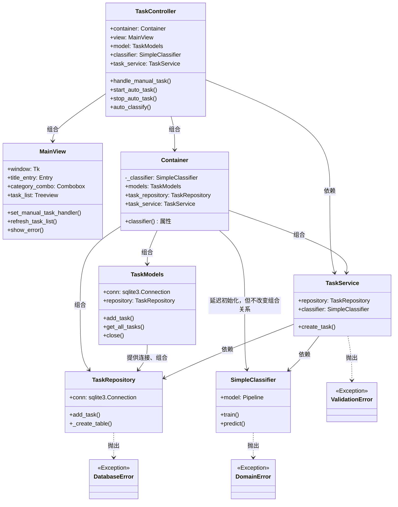
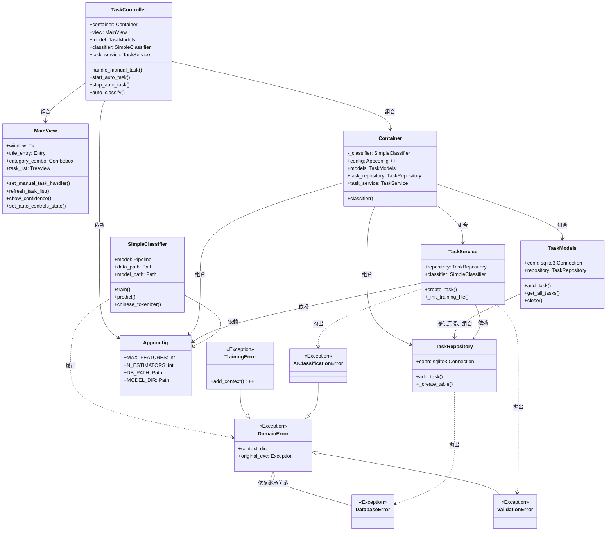

## [0.0.1] - 2025-02-14
### Added
- 新增功能：创建了mvp版本的main.py，并添加了一个测试数据，测试可以正常使用
- 新增功能：初始化数据库

## [0.0.2] - 2025-02-16
### Changed
- 迭代了database.py和main.py的部分代码，使之可以使用tk模块交互
### Added
- 增加了.gitignore作为版本控制

## [0.0.3] - 2025-02-17
### Changed
- 	更改了database.py的部分配置，使之适配未来需要的时间分类功能

## [0.0.4] - 2025-02-19
### Added
- 新增功能：完成了mvp版本预计的全部内容，包括自动与手动记录时间、任务工作分类计时等内容
### Changed
- 在deepseek的指导下开始着手进行按照mvc的重构，但是效果不理想

## [0.1.1] - 2025-02-21
### Deprecated
- 废弃功能：放弃了d指导的一步到位mvc重构，冲击太大了，暂时先完成了models的重构，并测试无误

## [0.1.2] - 2025-02-22
### Added
- 新增功能：完成了view视图的处理，并将main函数作为控制器，测试可以正常使用，这宣告mcv重构顺利完成

## [1.0.0] - 2025-02-24
### Added
- 新增功能：新增ai预测类别功能的mvp版本，但预测结果根本不准，仍需进一步优化

## [1.0.1] - 2025-02-25
### Fixed
- 修正代码：完善了逻辑，取消了一部分硬编码
- 修正代码：改正了database.py中SQL的插入表格语法错误

## [1.0.2] - 2025-02-26
### Added
- 新增功能：新增ai预测类别功能的置信度提示，但是暂时还无法再view里显示，等待后续更新吧

## [1.0.3] - 2025-02-27
### Fixed
- [1.0.3.a]重构了一部分代码，代码量已经有点大了，对于我这样的新手阅读都有点费劲了，或许我应该在d指导的帮助下进行分层架构的重构
- [1.0.3.b]在d指导的帮助下，在分层架构的设计原则下，尝试实践依赖注入和职责转移的设计思想
- 依赖注入 关注的是如何将对象所依赖的外部资源由外部传入，从而实现模块间的解耦与可测试性提高。
- 职责转移 则是将某个模块的部分职责交给其他更专门的模块来处理，从而实现关注点分离和系统整体的模块化设计。
- 下图是从mcv转为分层设计后的序列图，可以看到虽然模块变多了，但是逻辑清楚了不少


## [1.0.4] - 2025-02-28
### Deprecated
- 还原回了1.0.2，浪费了不少精力，但是实在是理不清方法之间的依赖关系了，之前的UML也白做了
### Fixed
- 转而重构了以下内容,可以看到是重构了，但是只重构了一点点，下一次更新应该关注于控制器，控制器已经有点尾大不掉了


## [1.0.5] - 2025-03-03
### Fixed
- 原有的转换器TfidfVectorizer默认使用基于正则表达式的分词，无法正确对中文文本分类，引入jieba分词。在d指导的帮助下，实现了一定程度的预测，但是具体的实现过程我还不太明白。
- 示例：
### Added
- 添加了懒加载和依赖注入部分的注释，我对这些方面的了解还是不够。
- 添加了类图，这个画的好。让我想起了学习软件工程这段时间关于组合的知识


## [1.0.6] - 2025-03-04
### Fixed
- 修改了requirements.txt的bcrypt依赖，更改版本至3.2，实测可以正常运行

## [1.1.0] - 2025-03-05
### Changed
- 将分类算法从LinearSVC升级为RandomForest，提高了分类准确率
- 优化了置信度计算方法，现使用RandomForest原生概率输出
- 更新了依赖库，添加了sklearn.ensemble

## [1.1.1] - 2025-03-07
### Deprecated
- 回退到了上个版本，模块之间出现了循环依赖如下。
```
task_repository → core.exceptions → core.container → task_repository//核心层依赖到仓储层了
```
- 目前的解决方式是手动调整，我希望最终能够做到完全的层次架构如下，但是这些更新要等到以后来做。我坚信对于中小型项目来说，与其遵循严格的分层架构，还是保障清晰的依赖关系比较重要。架构只是解决问题的方式不是引入问题的方式。
```
schedule_mvp/
├─ models/              # 业务实体和数据模型
│  ├─ task.py           # 纯数据实体
├─ repositories/        # 数据访问层
│  ├─ task_repository.py
├─ services/            # 业务逻辑层
│  ├─ task_service.py
├─ views/               # 表现层
├─ utils/               # 通用工具
│  ├─ ai_classifier.py
│  ├─ exceptions.py
├─ main.py              # 程序入口和依赖配置
```
一般的层次：表示层 → 控制器层 → 服务层 → 仓储层 → 模型层 → 数据层 → 核心层（依赖倒置原则）
分离关注点：
构造方法关注对象的基本结构
属性方法关注特定属性的访问逻辑
保持接口稳定：
外部代码使用container.task_repository，不需要知道它是属性还是方法
可以在不改变接口的情况下修改内部实现
优化资源使用：
只有真正需要时才创建资源密集型对象
避免创建可能永远不会使用的对象

## [1.1.2] - 2025-03-10
### Security
取消了主要文件的一部分硬编码，移动到目录下的core/config里，以后有机会可以尝试进一步把SQL部分也取消硬编码，但这部分不急。

## [1.1.3] - 2025-03-11
### Added
新增了任务数据持续收集的功能，现在模型可以不断演化了。但是仍然只是mvp版本。在未来计划加入数据清洗功能。


## [1.2.0] - 2025-03-12
### Added
- 完成了混淆矩阵的mvp版本，但是预测准确率是100%，这肯定有问题，等待后续修改

## [1.2.1] 
### Fixed
- 修改了ai分类器的evaluate方法，使之更加科学。

## [1.3.0] - 2025-3-21
### Fixed
- 解决了控制台打印两次日志的问题
### Changed
- 更改手动的tfidf+随机森林为BERT

---
https://mermaid-js.github.io/mermaid-live-editor/edit#pako:eNp9UctOwlAQ_RUyayBSWoEuTOShKzfiypbFlV4esfQ2l1ZFIPFBNJrwMBgXSoxGTVxq4sKEoD9DW_gLL2-IxllMZs49c-ZMbhGSRMEgQkol-8kMooZrKyxrLhb986p9X7EuqtK06rafnIdjp91kbcLl8ayU7HrDqt_Yrap1-Wi9n5QmU42aNK0Wpkbao5w3d9IU6ZnZqhE-iFUpQjSDElXFNDEHD7a6wpJz92HXXuxmtdtpbbAL1F-cyJhjPVecxln385Y57B-1e19XYyrWlP_MNGozxei8maF6TOq9nTrXr3FM97JJPLc9Jk2wIXFN-ttkbPi6LnU730xmE-sknzUILczMgRtymOZQVmHfUxzAMhgZnMMyiKxUEN2VQdbKjIdMg8QLWhJEg5rYDZSY6QyIKaTmWWfqCjJwNIvYfbkpqiNtm5CFHsQiHIDoCwa8vF8ICH6B9_kEjnNDAUTOGwyEQv4QtxQKcMs8zwtlNxwOFXzlH83i5KU


