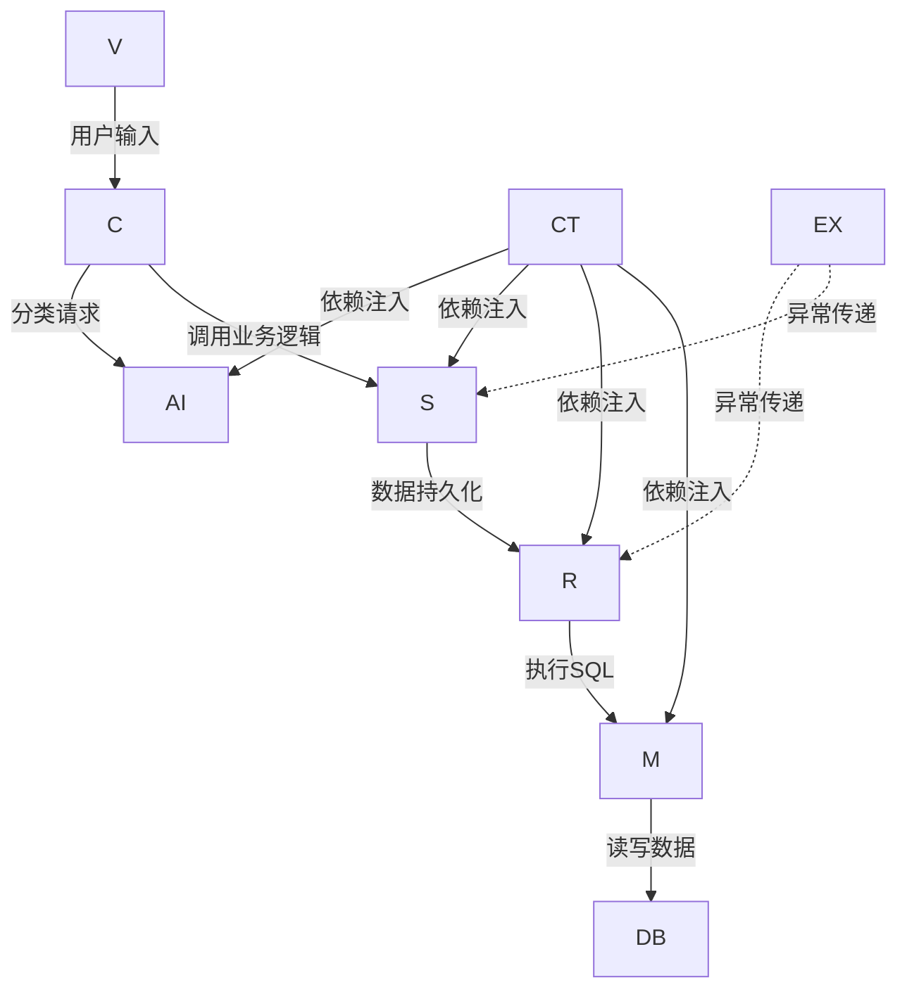

## [0.0.1] - 2025-02-14
### Added
- 新增功能：创建了mvp版本的main.py，并添加了一个测试数据，测试可以正常使用
- 新增功能：初始化数据库

## [0.0.2] - 2025-02-16
### Changed
- 迭代了database.py和main.py的部分代码，使之可以使用tk模块交互
### Added
- 增加了.gitignore作为版本控制

## [0.0.3] - 2025-02-17
### Changed
- 	更改了database.py的部分配置，使之适配未来需要的时间分类功能

## [0.0.4] - 2025-02-19
### Added
- 新增功能：完成了mvp版本预计的全部内容，包括自动与手动记录时间、任务工作分类计时等内容
### Changed
- 在deepseek的指导下开始着手进行按照mvc的重构，但是效果不理想

## [0.1.1] - 2025-02-21
### Deprecated
- 废弃功能：放弃了d指导的一步到位mvc重构，冲击太大了，暂时先完成了models的重构，并测试无误

## [0.1.2] - 2025-02-22
### Added
- 新增功能：完成了view视图的处理，并将main函数作为控制器，测试可以正常使用，这宣告mcv重构顺利完成

## [1.0.0] - 2025-02-24
### Added
- 新增功能：新增ai预测类别功能的mvp版本，但预测结果根本不准，仍需进一步优化

## [1.0.1] - 2025-02-25
### Fixed
- 修正代码：完善了逻辑，取消了一部分硬编码
- 修正代码：改正了database.py中SQL的插入表格语法错误

## [1.0.2] - 2025-02-26
### Added
- 新增功能：新增ai预测类别功能的置信度提示，但是暂时还无法再view里显示，等待后续更新吧

## [1.0.3] - 2025-02-27
### Fixed
- [1.0.3.a]重构了一部分代码，代码量已经有点大了，对于我这样的新手阅读都有点费劲了，或许我应该在d指导的帮助下进行分层架构的重构
- [1.0.3.b]在d指导的帮助下，在分层架构的设计原则下，尝试实践依赖注入和职责转移的设计思想
- 依赖注入 关注的是如何将对象所依赖的外部资源由外部传入，从而实现模块间的解耦与可测试性提高。
- 职责转移 则是将某个模块的部分职责交给其他更专门的模块来处理，从而实现关注点分离和系统整体的模块化设计。
- 下图是从mcv转为分层设计后的序列图，可以看到虽然模块变多了，但是逻辑清楚了不少

## [1.0.4] - 2025-02-28
### Deprecated
- 还原回了1.0.2，浪费了不少精力，但是实在是理不清方法之间的依赖关系了，之前的UML也白做了
### Fixed
- 转而重构了以下内容,可以看到是重构了，但是只重构了一点点，下一次更新应该关注于控制器，控制器已经有点尾大不掉了

---
https://mermaid-js.github.io/mermaid-live-editor/edit#pako:eNp9UctOwlAQ_RUyayBSWoEuTOShKzfiypbFlV4esfQ2l1ZFIPFBNJrwMBgXSoxGTVxq4sKEoD9DW_gLL2-IxllMZs49c-ZMbhGSRMEgQkol-8kMooZrKyxrLhb986p9X7EuqtK06rafnIdjp91kbcLl8ayU7HrDqt_Yrap1-Wi9n5QmU42aNK0Wpkbao5w3d9IU6ZnZqhE-iFUpQjSDElXFNDEHD7a6wpJz92HXXuxmtdtpbbAL1F-cyJhjPVecxln385Y57B-1e19XYyrWlP_MNGozxei8maF6TOq9nTrXr3FM97JJPLc9Jk2wIXFN-ttkbPi6LnU730xmE-sknzUILczMgRtymOZQVmHfUxzAMhgZnMMyiKxUEN2VQdbKjIdMg8QLWhJEg5rYDZSY6QyIKaTmWWfqCjJwNIvYfbkpqiNtm5CFHsQiHIDoCwa8vF8ICH6B9_kEjnNDAUTOGwyEQv4QtxQKcMs8zwtlNxwOFXzlH83i5KU
除了 Added（新增）和 Changed（变更）之外，常见的记录类型还有：

Deprecated（弃用）
表示某些功能或特性不推荐使用了，可能会在未来版本中移除。

Removed（移除）
表示某些功能或特性已被删除。

Fixed（修复）
用于记录修复的 bug 或问题。

Security（安全）
表示修复了安全漏洞或对安全相关的改进。