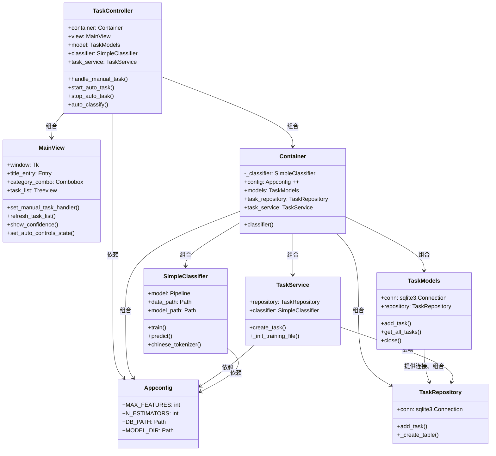

# 智能日程管理系统

一个基于机器学习的智能日程管理工具，能够自动分类和组织任务。系统允许使用自然语言，通过分析任务描述自动判断任务类型，帮助用户更高效地管理日常工作和生活安排。


## 关于版本
详细的版本更新见CHANGELOG.MD
- ✅ **0.x.x** - 已完成统计时间的基础功能，GUI搭建完成
- ✅ **1.0.x** - 已集成使用线性支持向量机（LinearSVC）的机器学习功能
- ✅ **1.1.x** - 更新分类算法，现在使用随机森林
- ✅ **1.2.x** - 集成混淆矩阵

## 功能特点

- 基于机器学习的任务自动分类
- 使用jieba进行中文文本处理与分析
- 比较准确的分类预测与置信度评估
- 简洁直观的用户界面
- 可训练模型，支持个性化分类需求

## 技术栈

- Python 3.11
- scikit-learn 
- NumPy 和 Pandas
- jieba 
- RandomForest 分类器
- TF-IDF 文本特征提取
- Tkinter
- SQlite

## 安装指南

```bash
# 克隆仓库
git clone https://github.com/Ace-XiaoChuan/Schedule_mvp

# 安装依赖
pip install -r requirements.txt

# 运行程序
python main.py
```

## 使用说明

1. 添加新任务：输入任务描述，系统会自动分类
2. 查看任务列表：按类别组织的任务视图
3. 训练模型：可以使用自定义数据集重新训练分类模型

## 项目结构

```
schedule_mvp/
├─ main
├─ models
├─ view
├─ assets/...
├─ ai/
│  ├─ ai_classifier
│  ├─ tasks.csv
│  ├─ simple_model.pkl
├─ core/
│  ├─ container.py
│  ├─ expections.py
│  ├─ config.py
│  ├─ logger.py
├─ repository/
│  ├─ task_repository.py
├─ services/
│  ├─ task_service.py
├─ README.md
├─ CHANGELOG.md
```
## 类图（UML）
为了篇幅考虑未加入错误处理相关类



## 开发文档

见该目录下的CHANGELOG.md

### 模型训练

系统使用RandomForest分类器，通过以下步骤进行训练：

1. 使用jieba进行中文分词
2. 应用TF-IDF进行特征提取
3. 训练RandomForest模型进行多分类

## 贡献指南

欢迎提交问题和改进建议！

## 版本历史

见CHANGELOG

## 本项目仍存在的问题

### 架构设计
- 依赖注入不彻底：控制器 中直接实例化 SimpleClassifier，未完全通过容器管理，破坏了解耦设计。
- 模块间耦合：部分代码（如视图层与控制器层）存在反向依赖，需进一步通过接口抽象解耦。

### AI分类模块
- 未提供与其他算法（如SVM、神经网络）的对比实验数据
- 特征工程优化缺失

## 未来优化的方向
- 提供随机森林与SVM、朴素贝叶斯等算法的对比实验
- 使用网格搜索（GridSearchCV）或贝叶斯优化确定最佳参数组合，并记录调优过程
- 尝试特征哈希（HashingVectorizer）替代TF-IDF，降低内存占用
- 单元测试覆盖

## 致谢

- jieba 中文分词库
- scikit-learn 机器学习库
- Tkinter
- SQlite